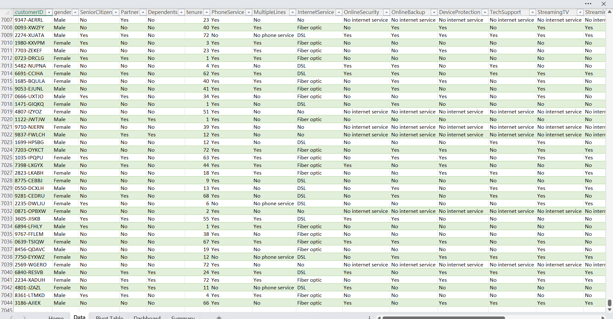
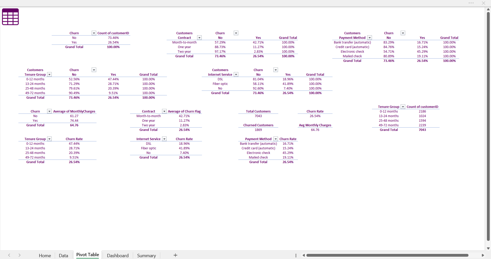
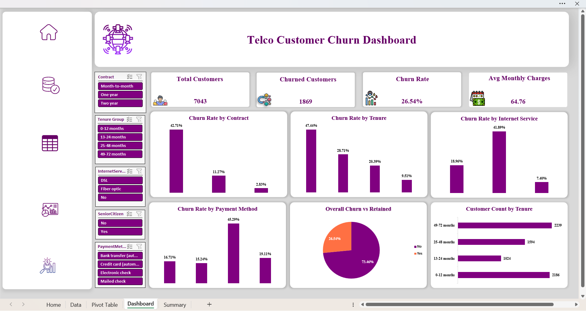
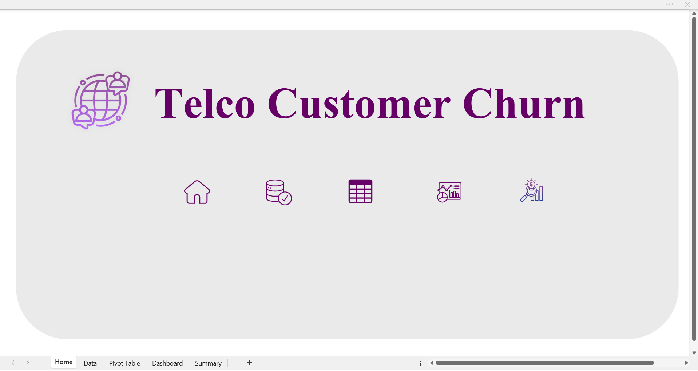
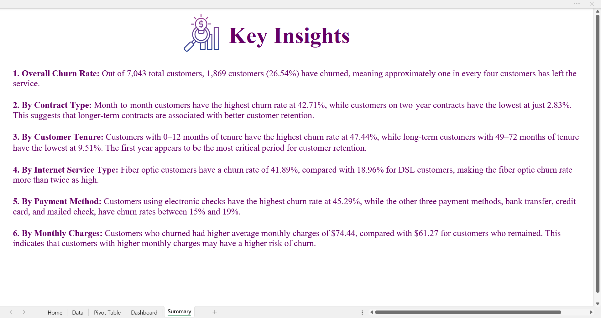

# Telco Customer Churn Dashboard (Excel)
 
An interactive Excel dashboard analyzing customer churn for a telecom company, built to identify which customer segments are most likely to leave and why.
 
## Business Problem
 
Customer churn — when a customer stops using a company's service — directly affects revenue. This project analyzes a telecom company's customer data to answer:
 
- What percentage of customers are churning?
- Which customer segments (contract type, tenure, internet service, payment method) have the highest churn rates?
- Is there a relationship between monthly charges and churn?
The goal is to help the business identify high-risk customer groups and prioritize retention efforts.
 
## Dataset
 
- **Source:** [Telco Customer Churn (Kaggle)](https://www.kaggle.com/datasets/blastchar/telco-customer-churn)
- **Size:** 7,043 customers, 21 original columns (23 after adding two calculated columns during cleaning — see below)
- **Key fields:** demographics (gender, senior citizen, partner, dependents), account info (tenure, contract, payment method, monthly/total charges), services subscribed (phone, internet, streaming, etc.), and churn status

 
## Data Cleaning (Power Query)
 
- Identified 11 customers with blank `TotalCharges` — all had `tenure = 0` (new customers with no billing history yet); replaced blanks with 0 rather than dropping the rows, since these are valid, active customers
- Checked `customerID` for duplicates — none found; confirmed 7,043 unique customers
- Standardized `SeniorCitizen` from 0/1 to No/Yes for consistency with other Yes/No fields
- Added a calculated `Tenure Group` column (0–12, 13–24, 25–48, 49–72 months) to group customers by how long they've been with the company, since raw tenure (73 distinct values) is too granular for charting
- Added a `Churn Flag` column (1/0) so churn rate could be calculated as an average, which allows it to update dynamically with dashboard slicers
## Analysis (PivotTables)
 
Built PivotTables in Excel to calculate churn rate as a percentage of each segment (not of the total), so the numbers reflect risk *within* each group:
 
- Overall churn rate
- Churn rate by Contract type
- Churn rate by Tenure Group
- Churn rate by Internet Service type
- Churn rate by Payment Method
- Average Monthly Charges: churned vs. retained customers
- Customer count by Tenure Group

 
## Dashboard
 
The final dashboard combines four KPI summary cards with six charts, all built using PivotCharts linked to the underlying PivotTables, plus a Home page and Summary sheet for navigation and written insights.
 

 
The workbook includes 5 sheets:
 
- **Home** — landing page with navigation to all sheets
- **Dashboard** — the main interactive dashboard
- **Pivot Table** — underlying PivotTables and calculations
- **Summary** — written key insights
- **Data** — raw dataset

 
**Dashboard features:**
- 5 Slicers (Contract, Tenure Group, Internet Service, Payment Method, Senior Citizen) — all linked, so filtering one updates every chart and KPI card
- 4 KPI cards: Total Customers, Churned Customers, Churn Rate, Avg Monthly Charges
- 6 charts: Churn Rate by Contract, by Tenure, by Internet Service, by Payment Method (clustered columns), Overall Churn vs. Retained (donut), Customer Count by Tenure (bar)
- Consistent color theme throughout
## Key Insights
 

 
1. **Overall Churn Rate:** Out of 7,043 total customers, 1,869 (26.54%) have churned — roughly one in every four customers has left.
2. **By Contract Type:** Month-to-month customers churn at 42.71%, compared to just 2.83% for two-year contracts. Longer-term contracts are strongly associated with better retention.
3. **By Customer Tenure:** New customers (0–12 months) churn at 47.44%, while long-term customers (49–72 months) churn at only 9.51%. The first year is the highest-risk period.
4. **By Internet Service Type:** Fiber optic customers churn at 41.89%, more than double the rate for DSL customers (18.96%).
5. **By Payment Method:** Customers paying by electronic check churn at 45.29%, notably higher than the other three payment methods (15–19%).
6. **By Monthly Charges:** Churned customers had a higher average monthly bill ($74.44) than retained customers ($61.27).
Taken together, the customers at highest risk of churning are those on month-to-month contracts, in their first year of service, using fiber optic internet, and paying by electronic check.
 
## Recommendations
 
- Encourage month-to-month customers to move to annual contracts through discounts or loyalty incentives.
- Focus retention efforts on customers within their first 12 months, since this is the most critical period.
- Investigate the electronic check payment experience — the churn gap between it and other payment methods is large enough to warrant a closer look.
- Review fiber optic pricing and service quality, since churn there is more than double the DSL rate.
## Tools & Techniques
 
- Excel Power Query (data cleaning, conditional columns)
- PivotTables & PivotCharts
- Slicers (multi-chart filtering)
- Excel Data Model / Relationships
- Dashboard design (KPI cards, navigation, custom color theming)
## Files
 
- `Telco_Customer_Churn_Dashboard.xlsx` — full workbook (raw data, cleaned data, PivotTables, dashboard)
- `home-page.png` — Home page screenshot
- `dashboard-preview.png` — full dashboard screenshot
- `pivot-table-summary.png` — PivotTable calculations screenshot
- `key-insights.png` — Key Insights (Summary sheet) screenshot
- `raw-data-preview.png` — raw dataset preview
## Next Steps
 
- Explore a combined risk score (contract + tenure + service type) to flag highest-risk customers directly
- Recreate the dashboard in Power BI to compare tooling
- Add a Revenue at Risk metric (total monthly charges from churned customers)
